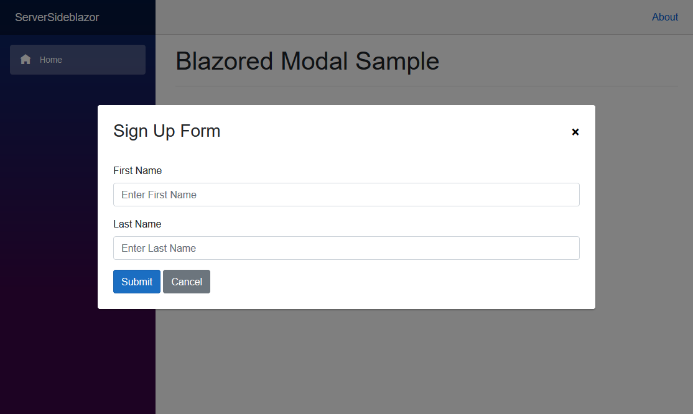

# Blazored Modal

A beautiful and customizable modal implementation for [Blazor](https://blazor.net) applications. It's free-range, gluten-free and 100% JavaScript free.




## Getting Setup

You can install the package via the nuget package manager just search for *Blazored.Modal*. You can also install via powershell using the following command.

```powershell
Install-Package Blazored.Modal
```

Or via the dotnet CLI.

```bash
dotnet add package Blazored.Modal
```

#### Internet Explorer 11
This package can be used with Internet Explorer 11, but some special care has to be taken.

- Only Blazor Server works with IE11. Blazor WebAssembly does not work with any IE version. See [this](https://docs.microsoft.com/en-us/aspnet/core/blazor/supported-platforms?view=aspnetcore-3.1)
- A [polyfill](https://github.com/Daddoon/Blazor.Polyfill) is necessary for this component to work. See [this](https://github.com/Daddoon/Blazor.Polyfill) page for an explanation on how to install and use it. The sample project for Blazor Server uses the polyfill and thus should work on IE11
- V4.2.0 or higher of `Blazored.Modal` should be used for correct CSS in IE11

Taking these things into account, `Blazored.Modal` should work on IE11.

### 1. Register Services

**For Blazor Server**: You will need to add the following using statement and add a call to register the Blazored Modal services in your applications `Startup.ConfigureServices` method.

```csharp
using Blazored.Modal;

public void ConfigureServices(IServiceCollection services)
{
    services.AddBlazoredModal();
}
```

**For Blazor WebAssembly**: You will need to add the following using statement and add a call to register the Blazored Modal services in your applications `Program.Main` method.

```csharp
using Blazored.Modal;

public static async Task Main(string[] args)
{
    var builder = WebAssemblyHostBuilder.CreateDefault(args);
    builder.RootComponents.Add<App>("app");

    builder.Services.AddBlazoredModal();

    await builder.Build().RunAsync();
}
```

### 2. Add Imports

Add the following to your *_Imports.razor*

```razor
@using Blazored
@using Blazored.Modal
@using Blazored.Modal.Services
```

### 3. Add Modal Component

Add the `<BlazoredModal />` tag into your applications *MainLayout.razor*.

### 4. Add reference to style sheet

Add the following line to the `head` tag of your `_Host.cshtml` (Blazor Server) or `index.html` (Blazor WebAssembly).

```html
<link href="_content/Blazored.Modal/blazored-modal.css" rel="stylesheet" />
```

## Usage
Please checkout the [sample projects](https://github.com/Blazored/Modal/tree/main/samples) in this repo to see working examples of the features in the modal. 

### Displaying the modal

In order to show a modal, you need to inject the `IModalService` into the component or service you want to invoke the modal. You can then call the `Show` method passing in the title for the modal and the type of the component you want the modal to display.

For example, if I have a component called `Movies` which I want to display in the modal and I want to call it from the `Index` component on a button click.

```razor
@page "/"
@inject IModalService Modal

<h1>Hello, world!</h1>

Welcome to Blazored Modal.

<button @onclick="@(() => Modal.Show<Movies>("My Movies"))" class="btn btn-primary">View Movies</button>
```

### Passing Parameters

If you want to pass values to the component you're displaying in the modal, then you can use the `ModalParameters` object. The name you provide must match the name of a parameter defined on the component being displayed.

#### Index Component

```razor
@page "/"
@inject IModalService Modal

<h1>My Movies</h1>

<ul>
    @foreach (var movie in Movies)
    {
        <li>@movie.Name (@movie.Year) - <button @onclick="@(() => ShowEditMovie(movie.Id))" class="btn btn-primary">Edit Movie</button></li>
    }
</ul>

@code {

    List<Movies> Movies { get; set; }

    void ShowEditMovie(int movieId)
    {
        var parameters = new ModalParameters();
        parameters.Add(nameof(EditMovie.MovieId), movieId);

        Modal.Show<EditMovie>("Edit Movie", parameters);
    }

}
```

#### EditMovie Component

```razor
@inject IMovieService MovieService
@inject IModalService ModalService

<div class="simple-form">

    <div class="form-group">
        <label for="movie-name">Movie Name</label>
        <input @bind="@Movie.Name" type="text" class="form-control" id="movie-name" />
    </div>

    <div class="form-group">
        <label for="year">Year</label>
        <input @bind="@Movie.Year" type="text" class="form-control" id="year" />
    </div>

    <button @onclick="SaveMovie" class="btn btn-primary">Submit</button>
    <button @onclick="BlazoredModal.Cancel" class="btn btn-secondary">Cancel</button>
</div>

@code {

    [CascadingParameter] BlazoredModalInstance BlazoredModal { get; set; }

    [Parameter] public int MovieId { get; set; }

    Movie Movie { get; set; }

    protected override void OnInitialized()
    {
        Movie = MovieService.Load(MovieId);
    }

    void SaveMovie()
    {
        MovieService.Save(Movie);
        BlazoredModal.Close(ModalResult.Ok<Movie>(Movie));
    }

}
```

### Modal Reference

When you open a modal you can capture a reference to it and await the result of that modal. This is useful when you want to perform an action when a modal is closed or cancelled.

```razor
@page "/"
@inject IModalService Modal

<h1>My Movies</h1>

<button @onclick="ShowModal" class="btn btn-primary">View Movies</button>

@code {
    async Task ShowModal()
    {
        var moviesModal = Modal.Show<Movies>("My Movies");
        var result = await moviesModal.Result;

        if (result.Cancelled)
        {
            Console.WriteLine("Modal was cancelled");
        }
        else
        {
            Console.WriteLine("Modal was closed");
        }
    }
}
```

### Returning objects back to the calling code

It is common to want to return messages or objects back from a modal to the calling code. This is achieved using the `ModalResult` class.

In the example below, when the form is submitted a `ModalResult.Ok` containing the string "Form was submitted successfully." will be returned back to the calling code. If it is cancelled a `ModalResult.Cancelled` will be returned.

```razor
<div class="simple-form">

    <div class="form-group">
        <label for="first-name">First Name</label>
        <input @bind="FirstName" type="text" class="form-control" id="first-name" placeholder="Enter First Name" />
    </div>

    <div class="form-group">
        <label for="last-name">Last Name</label>
        <input @bind="LastName" type="text" class="form-control" id="last-name" placeholder="Enter Last Name" />
    </div>

    <button @onclick="SubmitForm" class="btn btn-primary">Submit</button>
    <button @onclick="Cancel" class="btn btn-secondary">Cancel</button>
</div>

@code {

    [CascadingParameter] BlazoredModalInstance BlazoredModal { get; set; }

    bool ShowForm { get; set; } = true;
    string FirstName { get; set; }
    string LastName { get; set; }
    int FormId { get; set; }

    void SubmitForm()
    {
        BlazoredModal.Close(ModalResult.Ok($"Form was submitted successfully."));
    }

    void Cancel()
    {
        BlazoredModal.Cancel();
    }

}
```

Below is the caller for the component above. When the result is returned the string set in the `Ok` method can be access via the `Data` property on the `ModalResult`.

```razor
@page "/"
@inject IModalService Modal

<button @onclick="ShowModal" class="btn btn-primary">View Form</button>

@code {
    async Task ShowModal()
    {
        var formModal = Modal.Show<SignUpForm>("Please SignUp");
        var result = await formModal.Result;

        if (result.Cancelled)
        {
            Console.WriteLine("Modal was cancelled");
        }
        else
        {
            Console.WriteLine(result.Data);
        }
    }
}
```

The example above is only using a string value but you can also pass complex objects back as well. 

### Customizing the modal

The modals can be customized to fit a wide variety of uses. These options can be set globally or changed programatically on a per modal basis.

#### Hiding the close button

A modal has a close button in the top right hand corner by default. The close button can be hidden by using the `HideCloseButton` parameter:

`<BlazoredModal HideCloseButton="true" />`

Or in the `Modal.Show()` method:

```razor
@code {
    void ShowModal()
    {
        var options = new ModalOptions()
        {
            HideCloseButton = false
        };

        Modal.Show<Movies>("My Movies", options);
    }
}
```

#### Disabling background click cancellation

You can disable cancelling the modal by clicking on the background using the `DisableBackgroundCancel` parameter.

`<BlazoredModal DisableBackgroundCancel="true" />`

Or in the `Modal.Show()` method:

```razor
@code {
    void ShowModal()
    {
        var options = new ModalOptions()
        {
            DisableBackgroundCancel = true
        };

        Modal.Show<Movies>("My Movies", options);
    }
}
```

#### Styling the modal

You can set an alternative CSS style for the modal if you want to customize the look and feel. This is useful when your web application requires different kinds of modals, like a warning, confirmation or an input form.

Use the `Class` parameter to set the custom styling globally:

`<BlazoredModal Class="custom-modal" />`

Or in the `Modal.Show()` method:

```razor
@code {
    void ShowModal()
    {
        var options = new ModalOptions()
        {
            Class = "blazored-modal-movies"
        };

        Modal.Show<Movies>("My Movies", options);
    }
}
```

#### Setting the position

Modals are shown in the center of the viewport by default. The modal can be shown in different positions if needed. The positioning is flexible as it is set using CSS styling.

The following positioning styles are available out of the box: `blazored-modal-center`, `blazored-modal-topleft`, `blazored-modal-topright`, `blazored-modal-bottomleft` and `blazored-modal-bottomright`.

Use the `Style` parameter to set the custom styling globally:

`<BlazoredModal Position="blazored-modal-bottomleft" />`

Or in the `Modal.Show()` method:

```razor
@code {
    void ShowModal()
    {
        var options = new ModalOptions()
        {
            Position = "blazored-modal-bottomleft"
        };

        Modal.Show<Movies>("My Movies", options);
    }
}
```

#### Animation
By default, Blazored Modal supports 2 different animations: Fade-in and Fade-out. These 2 can also be combined to both fade-in and fade-out. By default no animation is used. If you want to use an animation for the modal, you can set one globally or per modal. 

##### Setting Animation Globally

To set a global animation for all modals in your application, you can set the `Animation` parameter on the `BlazoredModal` component in your `MainLayout`. Below sets a Fade-in animation with a duration of 2 seconds.

```razor
@inherits LayoutComponentBase

<BlazoredModal Animation="@(new ModalAnimation(ModalAnimationType.FadeIn, 2))"/>

<!-- Other code removed for brevity -->
```

##### Setting Animation Per Modal

To set the Animation of a specific modal instance you can pass in a `ModalOptions` object when calling `Show`. Below exapmle will add a Fade-in and Fade-out animation, which will take 1 second each.

```razor
var options = new ModalOptions { Animation = new ModalAnimation(ModalAnimationType.FadeInOut, 1)};

_ = Modal.Show<Confirm>("My Modal", options);
```


### Multiple Modals

It's possible to have multiple active modal instances at a time. You can find a working example of this in the sample projects but here is some sample code.

Below is a component which being displayed inside a Blazored Modal instance. When a user clicks on the _Delete_ button the `Yes` method is invoked and creates a new modal instance.  

```razor
@inject IModalService ModalService

<div class="simple-form">
    <div class="form-group">
        Are you sure you want to delete the record?
    </div>

    <button @onclick="Yes" class="btn btn-outline-danger">Delete</button>
    <button @onclick="No" class="btn btn-primary">Cancel</button>
</div>

@code {

    [CascadingParameter] BlazoredModalInstance BlazoredModal { get; set; }

    async Task Yes()
    {
        var confirmationModal = ModalService.Show<ConfirmationPrompt>();
        var result = await confirmationModal.Result;

        if (result.Cancelled)
            return;

        BlazoredModal.Close(ModalResult.Ok($"The user said 'Yes'"));
    }

    void No()
    {
        BlazoredModal.Close(ModalResult.Cancel());
    }

}
```
